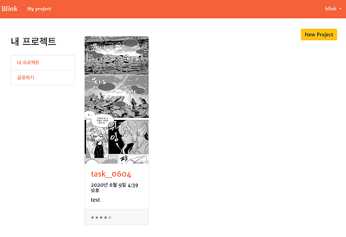
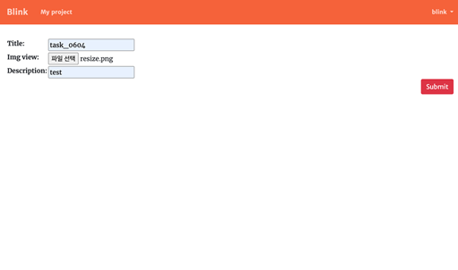
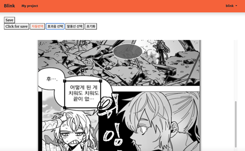
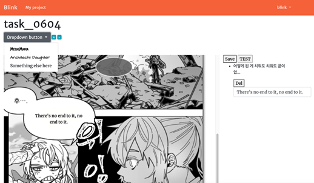
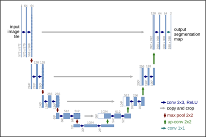
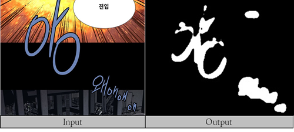
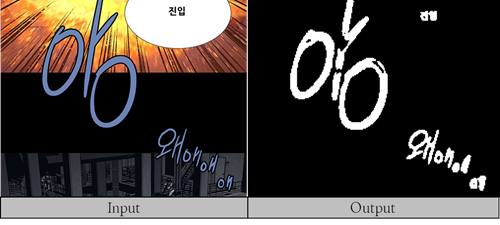
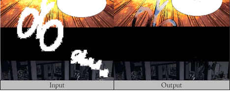
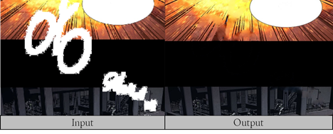
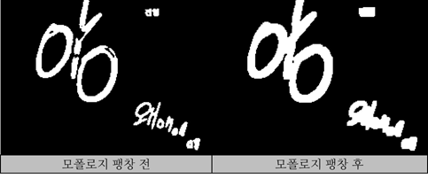

#  BLINK

# 0. BLINK 소개

웹툰 번역 과정에서의 작업 비용을 감소하기 위해 개발한 서비스로, 웹툰 작업 시 필요한 디자인 작업을 해결해 빠르고 간편한 WEB 기반 번역 tool을 제공하는 것이 목표이다.

배경글 수정 및 폰트 디자인 작업을 웹페이지에서 수행함으로써 작업자의 편의성을 향상시킬 수 있다.

BLINK 시스템을 통해 웹툰 뿐만 아니라 글씨를 포함하는 모든 컨텐츠 산업에 사용 가능한 번역 시스템을 개발하는 것이 최종 목표이다.

| 이름                                    | 역할                      |
| --------------------------------------- | ------------------------- |
| [신광현](https://github.com/S-GH)       | 팀장 \| Inpaint 모델 개발 |
| [김은아](https://github.com/Eunah-Kim)  | FE, BE                    |
| [이철희](https://github.com/cjfgml123)  | Segmentation 모델 개발    |
| [장희은](https://github.com/JANGHEEEUN) | FE, BE                    |


# 1. 설치

## 1.가상환경 설정

- mac os venv setting

  ```shell
  mkdir myproject
  cd myproject
  python3 -m venv venv
  
  source venv/bin/activate
  pip install -r requirements.txt
  ```

- window venv setting

  ```shell
  mkdir myproject
  cd myproject
  python -m venv venv
  
  venv/Scripts/activate
  pip install -r requirements.txt
  ```


## 2. API 설정

> 해당 프로젝트는 파파고 API 및 구글 OCR API가 필요하다.

### 2.1 파파고 API 설정

#### 2.1.1 API json 발급

<https://developers.naver.com/products/nmt/>

해당 웹페이지에 접속해 파파고 API의 ID와 비밀번호를 발급받는다.

#### 2.1.2 cv_function.py 수정

발급받은 아이디와 비밀번호를 cv_function.py에 입력

+-- BLINK
|   +-- web
|   |      +--  cv_function.py 

cv_function.py : 161line

```python
...
def trans_papago(txt):
    """ 파파고 API 실행 """
    # 파파고 API 아이디와 비밀번호를 입력해 주세요
    client_id = "" # 발급받은 ID 입력 
    client_secret = "" # 발급받은 PW 입력
...
```

### 2.2 구글 API 설정

#### 2.2.1 API json 발급

<https://cloud.google.com/vision/docs/before-you-begin?hl=ko>

<https://jungwoon.github.io/google%20cloud/2018/01/09/Vision-Api/>

위 링크를 참고해 json 키를 생성해야 한다.

#### 2.2.2 cv_function.py 수정

생성한 json 키의 경로를 cv_function.py에 입력

+-- BLINK
|   +-- web
|   |      +--  cv_function.py 


cv_function.py : 21line

```python
...
# 발급받은 json파일의 경로를 입력 해주세요
json_path = ''
...
```


## 3. 실행

```shell
python3 ../BLINK_master/web/manage.py makemigrations main
> main 입력 중요!!
python3 ../BLINK_master/web/manage.py migrate
python3 ../BLINK_master/web/manage.py createsuperuser
> 원하는 슈퍼유저 이름 및 비밀번호 등록
python3 ../BLINK_master/web/manage.py runserver
> http://127.0.0.1:8000/admin 에 접속후 앞서 설정한 슈퍼유저 아이디와 비밀번호 입력
> http://127.0.0.1:8000/intro 웹페이지 확인
```


# 2. BLINK 기능 소개

### 1. 프로젝트 생성

> /project & /create

구글 login 후, 개인만의 프로젝트를 생성할 수 있다.

프로젝트 생성 과정에서 이미지 업로드 시 백엔드에 원본 사진, Segmentation 모델 output, Inpaint 모델 Output이 저장된다.

   

### 2. 번역할 텍스트 위치 선정

> /project/pk

사용자가 자동으로 번역할 텍스트의 영역을 지정하는 페이지다. 수정 페이지에서 텍스트 번역 위치를 잡기 위한 과정으로 자동으로 처리할 수 있는 알고리즘을 개발중이다.

 

### 3. 텍스트 번역 결과 확인 및 수정

 

파파고 API를 통해 자동으로 번역된 결과를 확인하고, 원하지 않는 경우 수정할 수 있다.

글자의 폰트, 사이즈, 위치, 내용 등을 자유롭게 수정함으로써 번역가가 수월하게 작업할 수 있도록 했다.

### 4. 시연

 

# 3. 사용 기술

### 1. Segmentation 모델

#### 1.1 U-net

Segmentation은 번역 작업 중 **이미지 속 텍스트를 지우는 과정을 AI를 사용해 자동으로 처리하기 위한 모델**이다. 

이미지를 넣으면 이미지가 나오는 모델인 pix2pix 방식을 적용했으며, 가장 많이 쓰이고 성능이 보장된 U-Net architecture를 사용해 segmentation 모델을 구현했다.

> U-NET 구조

 

> U-NET 모델 훈련 결과

####  

#### 1.2 FPN

U-Net 모델에서 발생하는 정확도의 한계 문제를 해결하기 위해 FPN을 적용했다.

FPN은 U-Net과 흡사한 bottom-up 방식의 피라미드 구조를 가지고 있으며, feature map을 복사하는 작업 전에 `1*1 convolution layer를 추가`해 성능을 향상시켰다.

**IOE SCORE: 0.82**

> FPN 모델 훈련 결과

 


### 2. Inpaint 모델

Inpaint 모델은 Segmentation 모델의 output 영역을 배경과 비슷하게 채워주는 역할을 수행한다.

이미지의 패턴을 학습하는 p-conv 및 적대적 생성 신경망(GAN)을 사용해 디자이너의 작업 과정을 AI로 구현했다.

#### 2.1 Partial Convolution (P-Conv)

Nvidia에서 제안한 inpaint 방법 중 하나로 sliding window 진행 시 커널 안의 픽셀들의 합이 0 이상일 때만 계산을 진행하는 방식으로 mask된 이미지에 특화된 convolutional layer다.

`커널의 hole 영역이 점점 줄어드는 방식`으로 학습이 진행된다.

> p-conv 훈련 결과 
>
> input 이미지의 하얀 픽셀들이 `hole`이며 모델은 layer를 지나며 `hole`을 점점 채워나가는 방식으로 훈련된다.
>
> output 이미지를 통해 복잡한 패턴을 가진 배경은 잘 예측하지 못하는 것을 확인했다.

 

#### 2.2 GAN 

GAN은 생성자 모델과 판별자 모델이 서로 적대적으로 피드백을 주며 loss function 없이 model이 알아서 결과를 도출하는 모델이다.

GAN 중 백그라운드 feature를 잘 살려주는 `context attention GAN`을 사용했다.

`2.1 P-conv`와 비교했을 때 더 나은 성능을 보이는 것을 알 수 있다.

> GAN 모델 훈련 결과

 


### 3. OpenCV - Mask 후처리

모델이 예측한 글자의 일관성을 높이기 위해 computer vision library인 OpenCV를 사용했다.

segmentation 모델이 예측한 mask가 글자의 edge 부분을 다 인식하지 못하는 경우에 대비해 `openCV의 모폴로지 팽창`을 사용했다. 

모폴로지 팽창을 통해 segmentation 모델의 일관성을 높일 수 있었다.

> 모폴로지 팽창 적용 결과

 


### 4. OCR(광학 문자 인식)

자동 번역을 제공하기 위해서는 이미지 안의 텍스트를 인식해야 한다.

OCR을 사용해 이미지의 텍스트를 추출해 json 데이터로 저장했다.


### 5. WEB - Django / HTML, CSS, JS

AI 모델과 상호작용에 유리한 Django를 백엔드로 선정했다.

DB는 Django 기반 Sqlite를 사용하였으며, css, js, html을 사용해 프론트엔드를 구현했다.